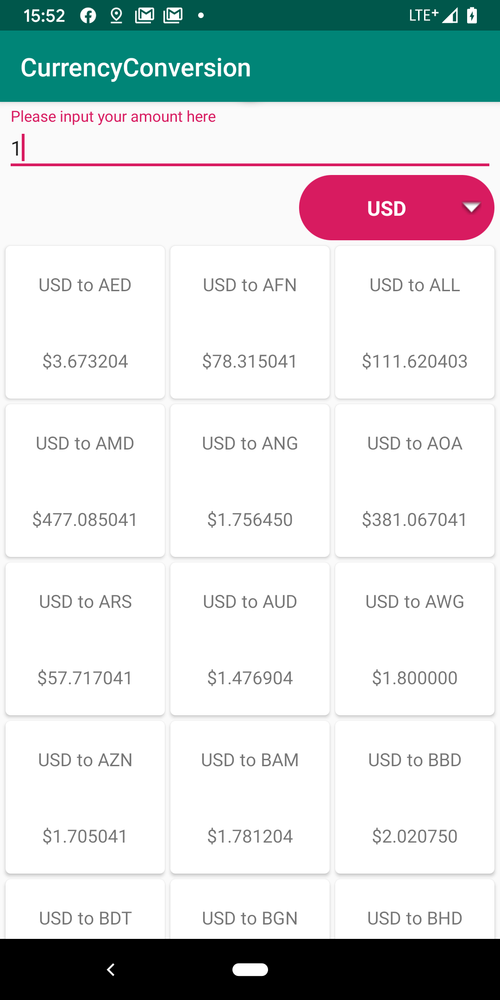

# CurrencyConversion
A currency conversion app

## Introduction
The CurrencyConversion is a demo for check exchange currency rate. The whole project is using MVVM to follow android architecture components. For support libs is using androidx and other libs use as latest version as possible.

## Demo Screenshot

## Third party libs
Third-party be used in this repo:

- Rxjava2
- OkHttp
- retrofit
- Glide
- Dagger2
- Data Binding

Test libs:

- Power mock
- Mockito

## CI/CD:

- Travis
- CircleCI
